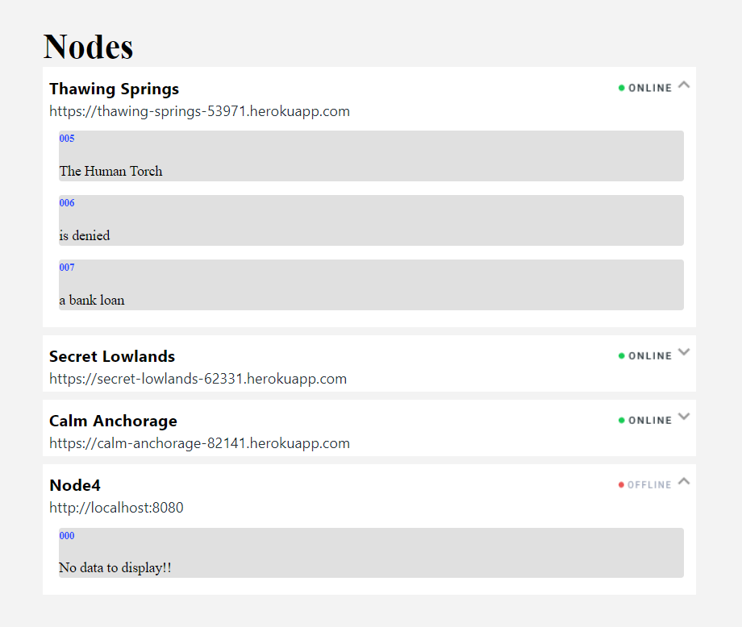

A screenshot of the app is presented below:

    

# Server-status-monitor

The current application is displaying a list of nodes. Don’t worry about what Nodes or Blocks are, just know that a Node has many Blocks. Each node represents a server. Each server implements the same API but returns different data. 

The important endpoints you will need to know for each server are: /api/v1/status /api/v1/blocks
 
Each node has many blocks and the blocks for each node are returned from the blocks endpoint. Currently the application is getting the status for each node and updating the state. We would like you to retrieve the blocks from the endpoint, place them in the state and render them into a list that matches the design.

UI design from Figma: https://www.figma.com/file/LEB9FcZn7dag16JFXvUG3K/React-Hiring-Test-(Copy)?node-id=11%3A26922

Endpoints configured on the app:

https://thawing-springs-53971.herokuapp.com

https://secret-lowlands-62331.herokuapp.com

https://calm-anchorage-82141.herokuapp.com

## Built With

- Javascript
- React
- Axios

## Live Demo (if available)

[Live Demo Link](https://server-status-monitor-djs6789ek-herokudev.vercel.app/)

## Getting Started

To get a local copy up and running follow these simple example steps.

### Prerequisites

- Git/GitHub;
- Optional ( IDE installed in your machine ) - recommended IDE: Vscode;
- Node or Yarn installed locally;

### Setup

- To clone this repo:
  - Open the Terminal(Mac/Linux) or the Cmd (Windows);
  - Navigate to where you want to paste the Repo folder;
  - Type `git clone https://github.com/herokudev/Server-status-monitor.git`;
  - Open the folder todo-list that was created on your IDE;

### Install

- To install all the dependencies in the package.json:
  - Open the Terminal(Mac/Linux) or the Cmd (Windows);
  - Navigate to be inside the todo-list repo folder;
  - Run npm install or npm i or yarn install;

## Authors

👨‍💻 **Herbert Orellana**
​
- GitHub: [@herokudev](https://github.com/herokudev)
- LinkedIn: [LinkedIn](https://www.linkedin.com/in/herbert-orellana//)

## Show your support

Give a ⭐️ if you like this project!

## 📝 License

This project is [MIT](./MIT.md) licensed.
